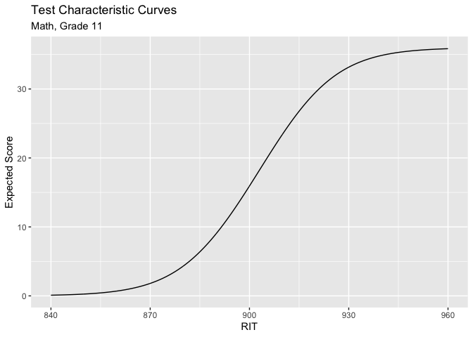
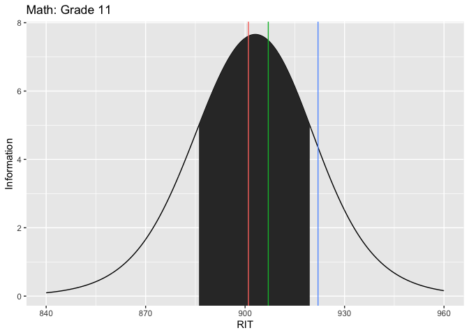

<!-- README.md is generated from README.Rmd. Please edit that file -->

# exirt

<!-- badges: start -->

[](https://github.com/UO-BRT/exirt/actions)
<!-- badges: end -->

The **exirt** is designed to automate annual analyses for the Oregon
Extended Assessment. It is the analysis arm of a suite of packages
designed to (a) access the live data via a web API
([orextdb](https://github.com/UO-BRT/orextdb)), (b) process the data for
different analyes and visualizaionts
([dbprocess](https://github.com/UO-BRT/dbprocess)), and (c) analyze the
data ([exirt](https://github.com/UO-BRT/exirt)).

Here are the three packages created by Daniel Anderson and maintained by
Christopher Loan:

    * `{orextdb}` — accesses data base
    * `{dbprocess}` — processes data
    * `{exirt}` — fit irt models, plot data, etc.

# Getting Set Up

These are stored on github in the UO-BRT organization. To install these,
use `devtools::install_github()` with the organization and package name,
separated by a slash:

## Install Packages

``` r
devtools::install_github('UO-BRT/orextdb')
devtools::install_github('UO-BRT/dbprocess')
devtools::install_github('UO-BRT/exirt')
```

## Load these packages

You’ll see I’m also loading the `{tidyverse}` for data manipulation.

``` r
library(orextdb)
library(dbprocess)
library(exirt)
library(tidyverse)
```

# `{orextdb}`

## Accessing the Data Base

You can check if you have access with `db_key()`. If this returns an
empty string, you do not have the key. You can set the key by wrapping
the key in quotes within `db_set_key()` (e.g.,
`db_set_key('asdfjkl-123456')`)

Let’s work with 2018-19 for our purposes. databases are specified with
the prefix “ORExt” and then the final two digits of the academic year.
So for 2018-19, we specify `db = 'ORExt1819'`.

We also have to specify which database we want. If we want to estimate
the ability estimates, we need to specify which table we want pulled
from the database.

This is done with the argument `table =`, which is a string specifying
the specific table from the Oregon Extended live database.

`table` should be one of

    * "Accomodations"
    * "Answers"
    * "Districts" 
    * "Exams"
    * "Items" 
    * "Preferences" 
    * "Schools"
    * "Students" 
    * "Students_old" 
    * "Submissions" 
    * "SupplementalDistricts"
    * "SupplementalSchools"
    * "Tasks"
    * "User" 
    * "UserStudents"
    * "UserStudents_old"

Check the documentation with `?db_get()` for further arguments, though
defaults have been set to be useful and will not need to be changed
typically.

``` r
answers_1819 <- 
  orextdb::db_get(
    table = 'Answers',
    db = 'ORExt1819'
    )

answers_1819
#> # A tibble: 381,603 × 13
#>    answer_id task_id question_id item_score duration answer_date  answer item_id
#>        <int>   <int>       <int>      <int>    <int> <chr>        <chr>    <int>
#>  1         7       2           1          1    12138 2019-02-14 … "A"        201
#>  2         8       3           1          1     4313 2019-02-15 … "B"        101
#>  3         9       3           2          1     2192 2019-02-15 … "A"        102
#>  4        10       3           3          1     3525 2019-02-15 … "B"        103
#>  5        11       3           4          0     4697 2019-02-15 … ""         104
#>  6        12       3           5          1    28603 2019-02-15 … "ring…     105
#>  7        13       3           6          0     4723 2019-02-15 … "B"        106
#>  8        14       3           7          1    36421 2019-02-15 … "Movi…     107
#>  9        15       3           8          1    35737 2019-02-15 … "The …     108
#> 10        16       3           9          0     4247 2019-02-15 … "B"        109
#> # … with 381,593 more rows, and 5 more variables: positions <chr>,
#> #   is_practice <int>, is_correct <int>, is_final <int>, image_name <chr>
```

``` r
students_1819 <- 
  orextdb::db_get(
    table = 'Students',
    db = 'ORExt1819'
    )
```

# `{dbprocess}`

The main function in `{dbprocess}` is `get_items()`. This function pulls
item level data with student demographics from the live ORExt database.
You have the option to specify a grade, content area, and if you want
demographics or not. If you do not specify, all grade and content areas
are selected and demographics are included.

Be sure to specify your database, if you don’t want it to pull based on
your date (which pulls the current year).

``` r
math_items <- 
  dbprocess::get_items(
    content = 'Math', 
    grade = 11,
    db = 'ORExt1819'
    )
```

# `{exirt}`

## estimate abilities (omitting field test)

We use `estimate_abilities()` provide test score data with `test` to
determine the ability estimates for all non-field-test items. We’ll
continue with only grade 11 math, but a list of test score data can be
passed to this argument.

``` r
math_abilities <- 
  exirt::estimate_abilities(
    test = math_items
    )
```

## estimate field test difficulty

With very similar specification to `estimate_abilities()`, we can
`estimate_ft_difficulties()` to determine the difficulty parameters of
the field-test items

``` r
math_ft_difficulty <- 
  exirt::estimate_ft_difficulties(
  test = math_items
)
```

## other functions

### fit Rasch models

The `rasch()` function his is mostly an internal function, called by the
functions above, but may be useful to someone wanting additional model
information. It uses `TAM::tam.mml()` to run the Rasch models. You can
tell this to omit the field test items or anchor the other items.

``` r
rasch_mod <- 
  exirt::rasch(
    test = math_items, 
    omit_field_test = TRUE, 
    anchored = FALSE
  )
```

### pulling information from Rasch model

We can get all of the field test item names from the Rasch model with
the function `get_ft_items()`

``` r
ft_item_names <- exirt::get_ft_items(rasch_mod)
```

We can then re-fit the rasch model without omitting the field test
items.

``` r
rasch_mod_ft <- 
  exirt::rasch(
    test = math_items, 
    omit_field_test = FALSE
  )
#> NOTE 1: User only provided digits 
#> 
#> NOTE 2: `db` argument must specify a 4-digit year, with the first two 
#> digits representing the start of the school year, and the 
#> last two digits representing the end of the school year. `db` may 
#> be passed with or without the `"ORExt"` prefix, e.g., `"1920"` 
#> or `"ORExt1920"`.
```

If we use the names of the field test items (defined above), we can then
fitler out the item difficulties, so we only look at the field test
items.

``` r
exirt::get_item_diffs(rasch_mod_ft) %>% 
  filter(item_id %in% ft_item_names$item_id)
#>        test          item_id difficulty        se      lower        upper
#> 1  Math_G11     M11FUN2.5H12  0.1756399 0.1050611  0.3815559 -0.030276064
#> 2  Math_G11    M11GCO4.13H12 -0.6104046 0.1131369 -0.3886603 -0.832148889
#> 3  Math_G11 M11FUN1.5_SAMPLE -1.2942515 0.1270250 -1.0452871 -1.543215939
#> 4  Math_G11    M11FUN1.5_H09 -0.7143247 0.1148417 -0.4892392 -0.939410286
#> 5  Math_G11    M11STP2.6_H12  0.4381129 0.1042515  0.6424421  0.233783760
#> 6  Math_G11    M11ALG2.3_H12  0.6227275 0.1042459  0.8270458  0.418409288
#> 7  Math_G11    M11FUN1.1AH11  0.7097838 0.1044056  0.9144150  0.505152708
#> 8  Math_G11    M11STP1.6AH10  0.1866722 0.1050081  0.3924844 -0.019140008
#> 9  Math_G11 M11STP1.5_SAMPLE  0.1976935 0.1049569  0.4034052 -0.008018254
#> 10 Math_G11 M11ALG1.1ASAMPLE  0.4054931 0.1043009  0.6099191  0.201067039
#> 11 Math_G11    M11GPE2.4_H12  0.7206872 0.1044329  0.9253719  0.516002444
#> 12 Math_G11    M11GPE2.7_H12  0.2087042 0.1049073  0.4143188  0.003089578
```

It might be useful to have a list of all raw scores, thetas, RIT scores,
and corresponding performance levels. All of this can be returned with
`exirt::raw_to_rit()`. This returns for all tests and grades, and can be
filtered by whatever grade you want with
`df %>% filter(test %in% c('Math_G3', 'ELA_G3'))` for example.

``` r
raw_to_rit_scores <- 
  exirt::raw_to_rit()

raw_to_rit_scores %>% 
  filter(test %in% c('Math_G3', 'ELA_G3')) %>% 
  head()
#>     test raw     theta  theta_se rit    rit_se perf_level
#> 1 ELA_G3   0 -5.191315 1.8498191 148 18.498191          1
#> 2 ELA_G3   1 -3.925769 1.0428151 161 10.428151          1
#> 3 ELA_G3   2 -3.145744 0.7657433 169  7.657433          1
#> 4 ELA_G3   3 -2.654300 0.6472933 173  6.472933          1
#> 5 ELA_G3   4 -2.281182 0.5790169 177  5.790169          1
#> 6 ELA_G3   5 -1.972874 0.5339494 180  5.339494          1
```

If you want these for the ELA subscores, you can repeat the call, but
add the `subscore = TRUE` argument (the default is `FALSE`, giving you
the Math, ELA, and Science scores).

``` r
raw_to_rit_subscores <- 
  exirt::raw_to_rit(subscore = TRUE)

raw_to_rit_subscores %>% 
  head()
#>     test raw      theta  theta_se rit    rit_se perf_level
#> 1 Wri_G3   0 -4.2644595 1.8653167 157 18.653167          1
#> 2 Wri_G3   1 -2.9547917 1.0752267 170 10.752267          1
#> 3 Wri_G3   2 -2.0974472 0.8202367 179  8.202367          1
#> 4 Wri_G3   3 -1.5094438 0.7254550 185  7.254550          1
#> 5 Wri_G3   4 -1.0168695 0.6838928 190  6.838928          1
#> 6 Wri_G3   5 -0.5611802 0.6697308 194  6.697308          2
```

### Item difficulties

``` r
item_difficulties <- 
  exirt::get_item_diffs(model_ob = rasch_mod)

item_difficulties %>% 
  head()
#>       test       item_id difficulty se lower upper
#> 1 Math_G11 M11STP1.1_L01      -1.25  0    NA    NA
#> 2 Math_G11 M11GRT2.5_M06      -1.18  0    NA    NA
#> 3 Math_G11 M11GMG1.1_M06      -1.08  0    NA    NA
#> 4 Math_G11 M11FUN3.7AM05      -1.08  0    NA    NA
#> 5 Math_G11 M11GMG1.1_H09      -0.87  0    NA    NA
#> 6 Math_G11 M11FUN3.9_L01      -0.82  0    NA    NA
```

## Plotting

### Test characteristic curves

``` r
tcc_plot <- 
  exirt::tcc_plot(
    item_diff_table = item_difficulties, 
    content = 'Math', 
    grades = "11"
    )

tcc_plot
```



### Test information functions

``` r
tif_plot <- 
  exirt::tif_plot(item_diff_table = item_difficulties) 

tif_plot
```


